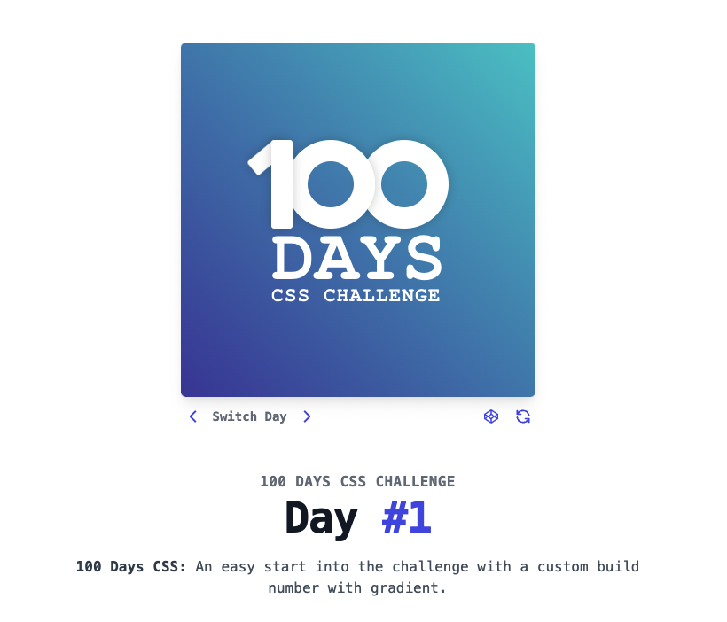
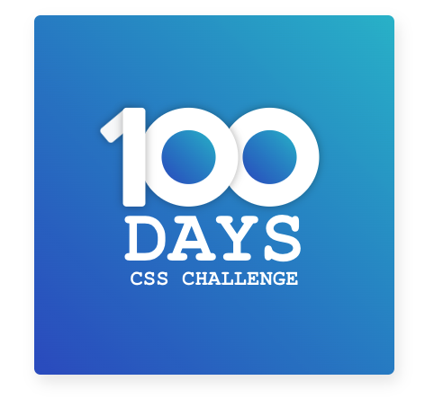

# CSS day01



A Pen created on CodePen.io. Original URL: [https://codepen.io/zhao-zihan-the-scripter/pen/PoRGpKx](https://codepen.io/zhao-zihan-the-scripter/pen/PoRGpKx).

## key takeaways

- create gradients

```CSS
  background-image: linear-gradient(to top right, #364fc7, #22b8cf);
```

- centering using absolute positioning

```CSS
  .center {
    position: absolute;
    top: 50%;
    left: 50%;
    transform: translate(-50%,-50%);
  }
```

- rotate element

```CSS
  transform: rotate(50deg);
```

- create vertical hierarchy

```CSS
  z-index: 1;
```

- shadow

```CSS
  box-shadow: 0 0 10px rgba(0, 0, 0, 0.3);

  box-shadow: none;
```

## final result


